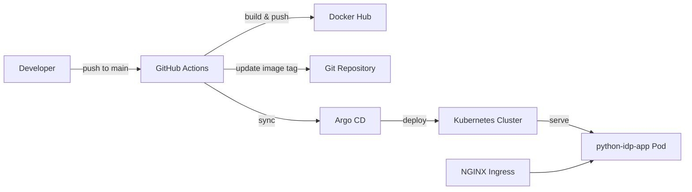

# Python IDP App — Technical Documentation

A sample Python service built for an Internal Developer Platform (IDP). It demonstrates a minimal Flask application packaged as a Docker image, deployed to Kubernetes with Helm, and delivered through a GitOps pipeline using GitHub Actions and Argo CD.

## Overview

| Property | Value |
|---|---|
| **Language** | Python 3.14 |
| **Framework** | Flask |
| **Container registry** | Docker Hub (`jtandy/python-idp-app`) |
| **Orchestration** | Kubernetes |
| **Deployment** | Helm chart + Argo CD |
| **CI/CD** | GitHub Actions |
| **Catalog** | Backstage (`catalog-info.yaml`) |

The application exposes health and metadata endpoints. It is intended as a reference implementation for IDP workflows: build, publish, deploy, and catalog a service end to end.

## Architecture



1. A developer pushes changes under `src/` to the `main` branch.
2. GitHub Actions builds a Docker image tagged with the short commit SHA and pushes it to Docker Hub.
3. The CD job updates `charts/python-idp-app/values.yaml` with the new image tag and commits the change.
4. Argo CD syncs the `python-idp-app` application, rolling out the new image to the cluster.
5. Traffic reaches the pod through a Kubernetes Service and NGINX Ingress.

## Project Structure

```
python-idp-app/
├── src/
│   └── app.py                 # Flask application
├── charts/
│   ├── python-idp-app/        # Helm chart for the application
│   │   ├── Chart.yaml
│   │   ├── values.yaml
│   │   └── templates/         # Deployment, Service, Ingress
│   └── argocd/
│       └── values-argo.yaml   # Argo CD Helm values
├── k8s/                         # Standalone Kubernetes manifests (legacy/reference)
├── .github/workflows/
│   └── cicd.yaml              # CI/CD pipeline
├── docs/
│   └── index.md               # This document
├── catalog-info.yaml          # Backstage component definition
├── dockerfile                 # Container image definition
└── requirements.txt           # Python dependencies
```

## Application

### Dependencies

- **Flask** — lightweight WSGI web framework (see `requirements.txt`)

### API Endpoints

| Method | Path | Description | Response |
|---|---|---|---|
| `GET` | `/` | Root health check | `{"status": "healthy"}` (200) |
| `GET` | `/api/v1/info` | Runtime metadata | JSON with timestamp, hostname, and deployment context |
| `GET` | `/api/v1/healthz` | Kubernetes-style liveness probe | `{"status": "up"}` (200) |

#### Example: `/api/v1/info`

```json
{
  "time": "2026-07-03 14:00:00",
  "hostname": "python-idp-app-abc123",
  "message": "This is the details page!",
  "deployed_on": "kubernetes"
}
```

The Flask development server listens on `0.0.0.0:5000` by default.

## Local Development

### Prerequisites

- Python 3.14+ (or compatible version)
- pip

### Run locally

```bash
pip install -r requirements.txt
python src/app.py
```

Verify the service:

```bash
curl http://localhost:5000/
curl http://localhost:5000/api/v1/info
curl http://localhost:5000/api/v1/healthz
```

## Docker

The image is built from `python:3.14-alpine3.22`. The Dockerfile installs dependencies, copies the application source, and starts the Flask app.

```bash
docker build -f dockerfile -t python-idp-app:local .
docker run -p 5000:5000 python-idp-app:local
```

## Kubernetes Deployment

### Helm Chart

The primary deployment mechanism is the Helm chart at `charts/python-idp-app/`.

| Setting | Default | Description |
|---|---|---|
| `replicaCount` | `1` | Number of pod replicas |
| `image.repository` | `jtandy/python-idp-app` | Docker image repository |
| `image.tag` | commit SHA | Image tag (updated by CI/CD) |
| `image.pullPolicy` | `Always` | Always pull the latest tag |
| `service.type` | `ClusterIP` | Internal cluster service |
| `service.port` | `5000` | Service and container port |
| `ingress.enabled` | `true` | Expose via Ingress |
| `ingress.className` | `nginx` | NGINX Ingress controller |
| `ingress.hosts[0].host` | `python-idp-app.local` | Ingress hostname |

Health probes hit `/` on the `http` port for both liveness and readiness checks.

#### Install with Helm

```bash
helm install python-idp-app ./charts/python-idp-app \
  --set image.tag=<commit-sha>
```

#### Upgrade

```bash
helm upgrade python-idp-app ./charts/python-idp-app \
  --set image.tag=<commit-sha>
```

### Legacy Manifests

The `k8s/` directory contains standalone Deployment, Service, and Ingress manifests. These serve as a reference or for manual deployment outside Helm. The Helm chart is the recommended path for production use.

## CI/CD Pipeline

The workflow in `.github/workflows/cicd.yaml` runs on:

- Push to `main` when files under `src/**` change
- Manual trigger via `workflow_dispatch`

### CI Job

Runs on `ubuntu-latest`:

1. Authenticates to Docker Hub using repository secrets
2. Computes a 7-character short SHA from the commit
3. Builds and pushes `jtandy/python-idp-app:<short-sha>`

### CD Job

Runs on a self-hosted runner and depends on CI:

1. Checks out the repository
2. Updates `charts/python-idp-app/values.yaml` with the new image tag using `yq`
3. Commits the values change back to the repository
4. Installs the Argo CD CLI
5. Logs in to Argo CD and syncs the `python-idp-app` application

### Required Secrets

| Secret | Purpose |
|---|---|
| `DOCKERHUB_USERNAME` | Docker Hub login |
| `DOCKERHUB_TOKEN` | Docker Hub access token |
| `ARGOCD_PASSWORD` | Argo CD admin password |

## Argo CD

Argo CD manages continuous deployment using the Helm chart in this repository. The CD pipeline triggers an application sync after each successful image build.

Argo CD server configuration overrides live in `charts/argocd/values-argo.yaml`, including:

- Single-replica controller, server, repo server, and application set
- Ingress enabled on `argocd.local.com` with TLS
- Redis HA disabled

## Backstage Integration

The service is registered in Backstage via `catalog-info.yaml`:

- **Kind:** Component
- **Type:** service
- **Owner:** development
- **Lifecycle:** experimental
- **GitHub slug:** `jtandy13/phython-idp-app`

Import this file into your Backstage catalog to surface the service in the developer portal.

## Operational Notes

- **Ingress host:** Add `python-idp-app.local` to your hosts file or DNS to reach the service locally during development.
- **Image tags:** Tags are immutable commit SHAs. The CD job keeps `values.yaml` in sync with the latest build.
- **Probes:** Kubernetes liveness and readiness probes use `/`. The dedicated `/api/v1/healthz` endpoint is available for external monitoring if preferred.
- **Scaling:** Horizontal Pod Autoscaling is disabled by default. Enable it in `values.yaml` by setting `autoscaling.enabled: true`.
